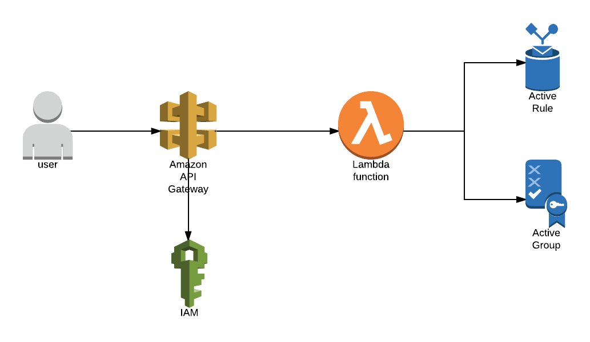

# AWS IoT Active Groups
This service provides a serverless implementation of Active groups in AWS IoT. Using this service, IoT groups can be configured to be populated with devices automatically based on device attributes in the shadow.

For ex: You can have a group called HighTemperature and enable it in such a way that all IoT Things that has an attribute called "Temperature" and with a value > 100, gets automatically added to the group

## Architecture:

### Creating Active groups

To create an active group, you will need to call the microservice rest api end point. The architecture for group creation is shown in the diagram below



### Active groups runtime

Once deployed the active groups are automatically activated and starts monitoring the device attribute changes in the shadow. In case of a breach in the defined threshold, the device is automatically added or removed from the group by the process lambda. The runtime flow is depicted below.


## Use Cases:
1. Dynamically group the devices based on an specific attributes
2. Use the active groups to monitor and react to device changes

## Deployment:
1. Clone the repo
2. Package the cloudformation
```
aws cloudformation package --template-file cfn/template.yaml --s3-bucket <YOUR_S3_BUCKET> --output-template-file cfn/packaged-template.yaml
```
3. Deploy cloudformation
```
aws cloudformation deploy --template-file cfn/packaged-template.yaml --capabilities CAPABILITY_IAM --stack-name <YOUR_STACK_NAME>
```

## Usage
### Invoke the API:
In your AWS console or CLI, discover your newly created API ARN resource name for your API URL prefix.
Or, assign your VPC subnet hostname or private DNS name as the endpoint.
##### CLI Use:
REST API usage:
```bash
curl -X POST -d '{...}' my_api_prefix.execute-api.{aws_region}.amazonaws.com/prod
```
##### Application Use:
See documentation on generating an API SDK for programmatic access: http://docs.aws.amazon.com/apigateway/latest/developerguide/how-to-generate-sdk.html  
And an example of Javascript SDK usage: http://docs.aws.amazon.com/apigateway/latest/developerguide/how-to-generate-sdk-javascript.html

### Input Format for New active group	
```
{
    "Operation": "NEW",
    "GroupName": "HighTemperature",
    "Attribute": "Temperature",
    "Operator": ">",
    "Threshold": "100"
}	
```

### Input Format for getting an existing active group	
```
{
    "Operation": "GET",
    "GroupName": "HighTemperature"
}
```

### Input Format for deleting an existing active group		
```
{
    "Operation": "DELETE",
    "GroupName": "HighTemperature"
}
```

## License
This is released under the MIT license. Details can be found in the LICENSE file.
